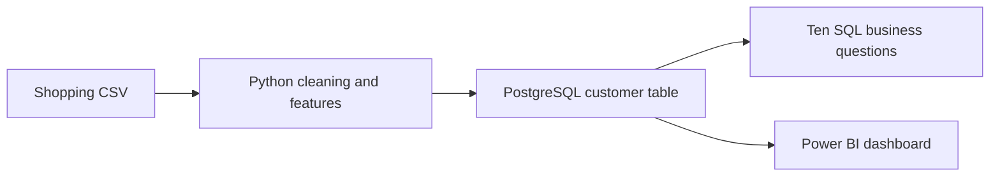

# Customer Shopping Behaviour Analysis

An end-to-end analytics project using **Python, PostgreSQL, and Power BI** to prepare customer shopping data, explore purchasing patterns, and support merchandising and customer-engagement questions.

## Workflow



## Business questions

- How does purchase value vary by customer group and shipping method?
- Which products receive the strongest ratings or are most frequently discounted?
- How do subscribers and non-subscribers differ in observed spending?
- What customer segments emerge from previous-purchase counts?
- Which products lead each category by observed purchase count?

## Methods

Python standardizes column names, fills missing ratings using category medians, creates age quartiles, and maps purchase-frequency labels to approximate day counts. SQL uses aggregation, subqueries, CASE expressions, CTEs, and window functions. The Power BI file presents the analysis visually.

**Interpretation:** this is shopping behaviour and segmentation analysis of a snapshot. It does not measure churn, cohort retention, or the causal effect of discounts/subscriptions. The original repository URL is retained for existing links.

## Files

| File | Purpose |
| --- | --- |
| [customer_retention.py](customer_retention.py) | Data preparation and PostgreSQL loading |
| [customer_retention.sql](customer_retention.sql) | Ten analytical questions |
| [Customer Behavior Dashboard.pbix](Customer%20Behavior%20Dashboard.pbix) | Downloadable Power BI report |
| [requirements-customer-retention.txt](requirements-customer-retention.txt) | Python dependencies |

## Data and results

The input `customer_shopping_behavior.csv` is not included, and its original download URL has not been verified. Supply the original file to reproduce the analysis. Numerical business findings and a dashboard screenshot are not presented here until they can be checked against that data/report. The PBIX requires Power BI Desktop to inspect; GitHub cannot render it directly.

## Analytical assumptions

- Segment labels are rules, not predictions: **New** = 0–1 previous purchases, **Returning** = 2–10, **Loyal** = more than 10, and **Unknown** = missing or invalid values.
- Age-group labels refer to sample quartiles, not fixed demographic age ranges. Repeated quartile boundaries can prevent `qcut` from forming four groups.
- Discount percentages retain decimal precision. Product-ranking ties use product name for consistent ordering.
- A category with no valid ratings retains missing ratings; unfamiliar purchase-frequency labels remain missing.
- Verify one row per customer before interpreting row counts as customer counts. The current script replaces the destination table each run.

## Run

1. Create a PostgreSQL database named `customer_behavior` on `localhost:5432`.
2. Install the Python dependencies in your selected interpreter:

   ```powershell
   python -m pip install -r requirements-customer-retention.txt
   ```

3. Load the data:

   ```powershell
   python customer_retention.py
   ```

   The script asks for the local `postgres` user's password. You can also pass `--csv`, `--database-url`, or `--table`. Each run replaces the destination table.
4. Open `customer_retention.sql` in pgAdmin's Query Tool, connect to `customer_behavior`, and run the queries.
5. Open the `.pbix` file in Power BI Desktop. If prompted to update the data source, point it to your PostgreSQL server and the `customer_behavior` database, then enter your own database credentials.

The Python and SQL files do not store a database password.


## Validation

SQL percentage and segmentation corrections were checked using synthetic boundary cases. The original dataset and a live PostgreSQL database were not available for a full rerun.
